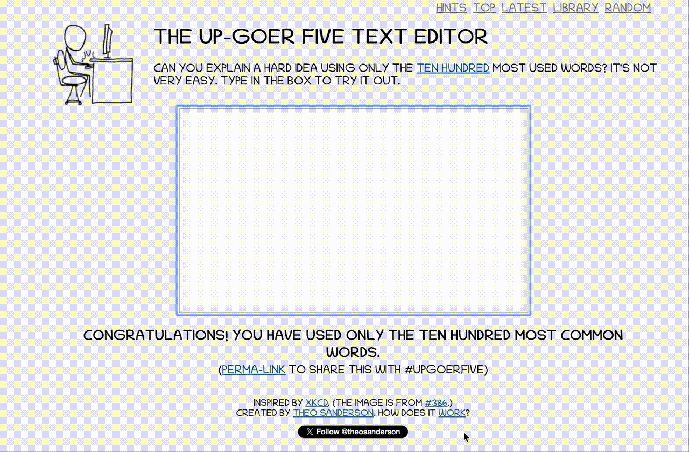

# Explainer of Words for Computer People and Things

## Explaining Work with Computers to Find Things Out

We use our brains to think of different ways to tell computers to do what we want, to help us understand things about the world or about us. A lot of people do not understand what we do. So, we want to explain what we do!

We want to explain to people that do not work with computers as well as to people that work with computers in a *different* way to us. This is important to us, as it helps people understand what we do and why. This allows people to ask questions, and makes us better at our jobs? Computer jobs are changing, we still need to understand things: this conversation should happen!

# How can I use this or help us make this better?

This can be used to help talk about the things we do with computers to other people, such as children or people who work in other places. 
It can help us think about the way that we talk about what we do and how we do it in a simple and clear way.

Try using it when you talk about what you do to your friends, family and people you work with. 

If you would like to help make this better, you can add a new way to explain your job or important things to explain to help people. You can also suggest a change.

# Things to help you understand

Thing to check if you can explain a hard idea using only the ten hundred most used words by typing in a box: https://splasho.com/upgoer5/

# How is this shared so you can use it?

The things in this store of steps, to control a computer, can be used by other people using the [CC BY 4.0](https://creativecommons.org/licenses/by/4.0/) way of sharing. This lets you share, use again, and change these things as you would like, as long as you keep our names and don't get us in trouble if this isn't quite right.

# Who made this?

This was made at [CW26](https://www.software.ac.uk/workshop/collaborations-workshop-2026-cw26), an often exciting and sometimes fun meeting bringing many different people to have interesting conversations to change the world and themselves. The people who have helped make this are:

<!-- ALL-CONTRIBUTORS-LIST:START - Do not remove or modify this section -->
<!-- prettier-ignore-start -->
<!-- markdownlint-disable -->
<table>
  <tbody>
    <tr>
      <td align="center" valign="top" width="14.28%"><a href="https://github.com/SaranjeetKaur"> <b>Saranjeet Kaur</b></a> <a href="#content-SaranjeetKaur" title="Content">🖋</a></td>
      <td align="center" valign="top" width="14.28%"><a href="http://www.lannelongue-group.org"> <b>Loïc Lannelongue</b></a> <a href="#projectManagement-Llannelongue" title="Project Management">📆</a></td>
      <td align="center" valign="top" width="14.28%"><a href="https://orcid.org/0000-0002-9324-2775"> <b>Paddy McCann</b></a> <a href="#content-pgmccann" title="Content">🖋</a> <a href="#ideas-pgmccann" title="Ideas, Planning, & Feedback">🤔</a> <a href="#research-pgmccann" title="Research">🔬</a></td>
      <td align="center" valign="top" width="14.28%"><a href="http://www.software.ac.uk"> <b>Neil Chue Hong</b></a> <a href="#content-npch" title="Content">🖋</a> <a href="#research-npch" title="Research">🔬</a> <a href="#ideas-npch" title="Ideas, Planning, & Feedback">🤔</a></td>
      <td align="center" valign="top" width="14.28%"><a href="https://hui-ling-wong.com/"> <b>Hui Ling Wong</b></a> <a href="#ideas-wong-hl" title="Ideas, Planning, & Feedback">🤔</a> <a href="#research-wong-hl" title="Research">🔬</a></td>
      <td align="center" valign="top" width="14.28%"><a href="https://colinsauze.github.io/"> <b>Colin Sauze</b></a> <a href="#ideas-colinsauze" title="Ideas, Planning, & Feedback">🤔</a> <a href="#research-colinsauze" title="Research">🔬</a></td>
      <td align="center" valign="top" width="14.28%"><a href="http://sfmig.github.io"> <b>sfmig</b></a> <a href="#ideas-sfmig" title="Ideas, Planning, & Feedback">🤔</a> <a href="#research-sfmig" title="Research">🔬</a> <a href="#content-sfmig" title="Content">🖋</a></td>
    </tr>
    <tr>
      <td align="center" valign="top" width="14.28%"><a href="http://sdruskat.net"> <b>Stephan Druskat</b></a> <a href="#ideas-sdruskat" title="Ideas, Planning, & Feedback">🤔</a> <a href="#research-sdruskat" title="Research">🔬</a> <a href="#code-sdruskat" title="Code">💻</a></td>
      <td align="center" valign="top" width="14.28%"><a href="https://github.com/jshng-glasgow"> <b>jshng-glasgow</b></a> <a href="#ideas-jshng-glasgow" title="Ideas, Planning, & Feedback">🤔</a> <a href="#research-jshng-glasgow" title="Research">🔬</a> <a href="#content-jshng-glasgow" title="Content">🖋</a> <a href="#review-jshng-glasgow" title="Reviewed Pull Requests">👀</a></td>
      <td align="center" valign="top" width="14.28%"><a href="https://github.com/RayStick"> <b>Rachael Stickland</b></a> <a href="#ideas-RayStick" title="Ideas, Planning, & Feedback">🤔</a> <a href="#research-RayStick" title="Research">🔬</a> <a href="#content-RayStick" title="Content">🖋</a> <a href="#review-RayStick" title="Reviewed Pull Requests">👀</a> <a href="#projectManagement-RayStick" title="Project Management">📆</a></td>
      <td align="center" valign="top" width="14.28%"><a href="https://github.com/tsmbland"> <b>Tom Bland</b></a> <a href="#ideas-tsmbland" title="Ideas, Planning, & Feedback">🤔</a> <a href="#research-tsmbland" title="Research">🔬</a> <a href="#content-tsmbland" title="Content">🖋</a> <a href="#review-tsmbland" title="Reviewed Pull Requests">👀</a></td>
      <td align="center" valign="top" width="14.28%"><a href="https://github.com/ipiriyan2002"> <b>Piriyan Karu</b></a> <a href="#ideas-ipiriyan2002" title="Ideas, Planning, & Feedback">🤔</a> <a href="#research-ipiriyan2002" title="Research">🔬</a> <a href="#content-ipiriyan2002" title="Content">🖋</a></td>
    </tr>
  </tbody>
</table>

<!-- markdownlint-restore -->
<!-- prettier-ignore-end -->

<!-- ALL-CONTRIBUTORS-LIST:END -->
